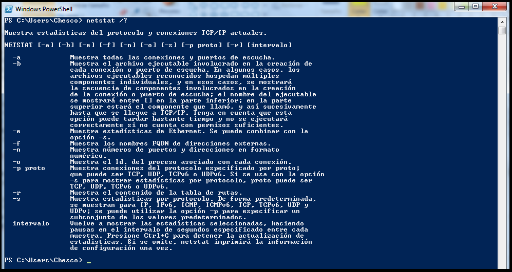
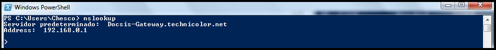
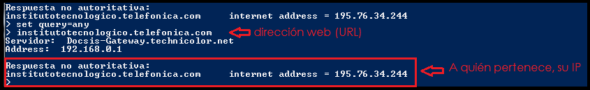

# 01.- ¿Cómo sabemos si tenemos acceso a internet? 

Para saber si tenemos acceso a internet, lo primero que debemos conocer es nuestra dirección IP. Para ello, vamos a abrir la consola de nuestro Sistema Operativo que en mi caso, al utilizar un S.O. Windows7, abriré la **consola de comandos powerShell.** Una vez abierta, empezamos a trabajar con ella. 

**¿Cómo se usa?** Lo usaremos escribimos el comando **"ipconfig"** para conocer nuestra dirección IP. 

**¿Qué hace el comando?** Observamos que nos aparece un listado con los datos de nuestra conexión red. En dicho listado, debemos localizar la tarjeta de red que estamos utilizando y nos fijaremos en la entrada **IPv4**, que será la que nos indique la dirección IP asignada a nuestro equipo.

Ahora que ya conocemos nuestra dirección IP, vamos a comprobar si tenemos acceso a internet. Podemos comprobar nuestra conexión, utilizando el comando **ping**. Para ello, vamos a escribir **ping nuestraDirecciónIp**.

**¿Por qué responde a la pregunta?** Si nos fijamos, vemos que nos indica el número de paquetes que envía, el tamaño en bytes que ocupa cada uno de ellos y el tiempo que tarda en enviarlo. Después, nos manda la estadística del **comando ping** para nuestra dirección IP y nos informa de los paquetes que ha enviado, recibido y perdido. 

**¿Cómo se interpreta la salida?** Si recibimos el mensaje de que no se ha perdido ningún paquete "<0% perdidos>", significará que nuestra conexión a internet es correcta. Por el contrario, nos saldrá un mensaje diciendo "Tiempo de espera agotado para esta solicitud" lo que significará que habrá existido algún tipo de error de conexión, a causa del router por ejemplo, o lo que sea.

# 2.- ¿Cómo sabemos si nuestro servidor es accesible desde internet? 

Para saber si nuestro servidor es accesible desde internet, debemos ver los puertos abiertos en nuestro Sistema Operativo. 

**¿Qué hace el comando?** Al utilizar un S.O. Windows, necesitaremos el comando **netstat** ("**ufw**" para Linux).

Ahora bien, nos surge la duda de **¿Cómo se usa o qué hace éste comando?** para ello, podemos pedir ayuda a nuestra consola, escribiendo **netstat /?** que nos mostrará un menú de opciones como muestro en la siguiente imagen:

**¿Por qué responde a la pregunta?** Observamos que el comando **netstat -a** lo que hace es mostrar las estadísticas del protocolo y conexiones TCP/IP actuales. Como lo que queremos es saber si nuestro servidor es accesible desde internet, vamos a buscar nuestro servidor y ver qué ocurre. 

En mi caso concreto, estoy usando un servidor *Apache Tomcat* que está utilizando el puerto **8083**

A continuación, utilizando *netstat -a* vemos que nuestro servidor sí que está escuchando, aunque en éste caso no es accesible desde internet si que es accesible de manera local. Por lo que, podemos saber si nuestro servidor es accesible desde internet mirando las conexiones activas y viendo si se encuentra en la columna "local" o "remota". 

Muestro aquí **cómo se comporta la salida**.

# 3.- ¿Cómo sabemos a quién pertenece una dirección web (URL)?

Para poder saber a quién pertenece una dirección web (URL), podemos utilizar tanto el comando **nslookup** como también el comando **dig** en windows, a partir de la versión 10. En mi caso como ya mencioné, mi S.O. es Windows 7 por tanto lo realizaré con *nslookup*. Pero... **¿qué hacen estos comandos?**

Ambos comandos son una herramienta muy útil que podemos utilizar para consultar servidores y permite a los usuarios realizar consultas a los distintos registros DNS. 

Con **nslookup**, podemos obtener la dirección IP asociada a un nombre DNS y viceversa, además, podemos preguntar a los servidores de nombres información relativa a los registros de recursos (RR) de las zonas de las que son autorizados.

**Nota:** nslookup se usa de dos modos: interactivo y no interactivo. El modo interactivo permite al usuario consultar los servidores DNS para obtener información sobre varios hosts y dominios o para listar los hosts de un dominios. El modo no interactivo se usa para presentar solo el nombre y la información solicitada para un host o nombre DNS.

**¿Cómo se usa?**
Primero tenemos que iniciar el comando en nuestro terminal. Para ello, simplemente lo escribimos y pulsamos "enter"

Podemos obtener ayuda escribiendo *help* para ver qué necesitamos saber en concreto y solicitarlo

**¿Por qué responde a mi pregunta?** Porque si indicamos una dirección web, la que sea, nos dice a quién pertenece. Por poner un ejemplo, vamos a ver a quién pertenece la web (URL) del instituto (ITT). Yo le voy a decir que me de toda la información, por lo que usaré "set query=any" tal como nos indica en la ayuda del comando.

**Así interpreta la salida:**

# 4.- ¿Cómo probamos que podemos acceder a un servidor?

Para acceder a un servidor, podemos utilizar el comando **wget** ó **curl** ya que es una opción disponible al usuario. Trata de un programa de línea de comandos con la biblioteca correspondiente incluida y que permite la transferencia de datos entre ordenadores interconectados.

